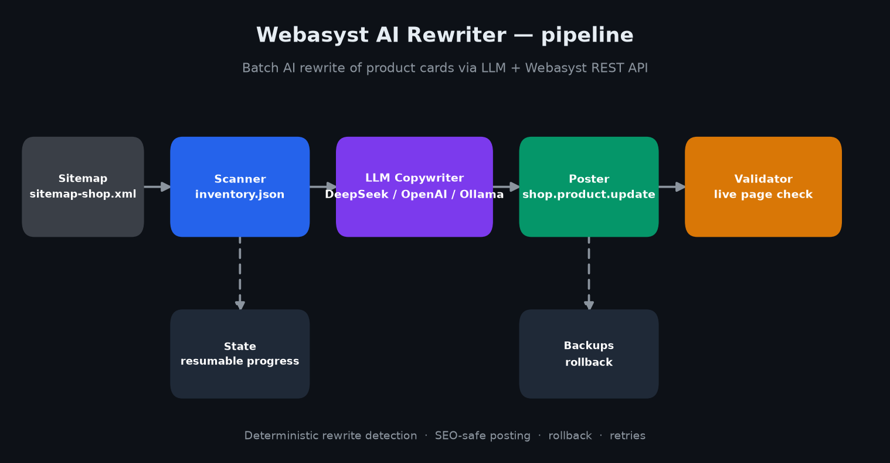

# webasyst-ai-rewriter

Массовый AI-рерайт карточек товаров **Webasyst / Shop-Script** с помощью
любой OpenAI-совместимой LLM (DeepSeek, OpenAI, OpenRouter, локальная Ollama…).

Инструмент сканирует каталог, находит карточки со старым форматом описания,
переписывает каждую через LLM по строгому шаблону, публикует результат через
REST API Webasyst и проверяет изменения на живой странице — автоматически,
контролируемыми батчами и с полным откатом.



## Какую задачу решает

Ручной рерайт сотен карточек — это недели монотонной работы. Проект превращает
её в управляемый конвейер:

```
sitemap → сканер → inventory → LLM-копирайтер → постер → валидатор
                                 ↑                            │
                                 └──────── status + backups ──┘
```

Решение построено на реальном каталоге из **728 товаров**: весь каталог
обработан батчами по 50 без потери данных — перед каждой записью сохраняется
бэкап, а каждая карточка повторно проверяется на сайте до статуса `done`.

## Возможности

- **Сканер каталога** — обходит sitemap, скачивает страницы и извлекает
  название, характеристики, старое описание и краткое описание (многопоточно).
- **Детерминированное определение рерайта** — карточка требует переработки,
  если в описании нет настраиваемых CSS-маркеров (`faq-item`, `facts-wrapper`).
- **LLM-копирайтер** — строгий промпт с few-shot примером; модель возвращает
  JSON (`description_html`, `summary_text`, опционально SEO-мета-теги).
- **Безопасная SEO-публикация** — `meta_title` / `meta_description` пишутся
  только в пустые поля, существующие SEO не перезаписываются.
- **Откат** — предыдущее состояние каждого товара сохраняется в
  `data/backups/` перед обновлением.
- **Валидация** — после публикации страница перезагружается для проверки
  маркеров (с ретраями на случай кэша).
- **Возобновляемые запуски** — прогресс в `data/state.json`; повторный запуск
  пропускает `done` и повторяет `error`.
- **WAF-совместимый клиент** — `access_token` в query-строке с браузерным
  User-Agent (работает на хостингах, режущих заголовок `Authorization`).
- **Любой LLM-провайдер** — любой OpenAI-совместимый endpoint, включая Ollama.

## Требования

- Python 3.10+
- Сайт на Webasyst / Shop-Script с доступом к REST API (`api.php`)
- OpenAI-совместимый LLM endpoint + API-ключ

## Быстрый старт

```bash
# 1. Клонировать и установить зависимости
git clone https://github.com/YanChi-pixel/webasyst-ai-rewriter.git
cd webasyst-ai-rewriter
python -m venv .venv
.venv\Scripts\activate          # Windows
# source .venv/bin/activate     # macOS / Linux
pip install -r requirements.txt

# 2. Настроить
copy .env.example .env          # Windows
# cp .env.example .env          # macOS / Linux
# …открыть .env и заполнить значения

# 3. Просканировать каталог
python -m src.scanner

# 4. Запустить батч из 50 товаров
python -m src.pipeline 50

# 5. Сформировать отчёт по обработанным ссылкам
python -m src.make_report
```

Каждый скрипт можно запускать и напрямую из папки `src/`
(например, `python src/pipeline.py 50`) — модули поддерживают оба способа.

## Получение токена Webasyst

Webasyst использует OAuth 2.0. Проще всего — «клиентский» флоу: токен
приходит прямо в адресную строку.

1. Войди в админку `https://your-shop.example.com/webasyst` под пользователем
   с правами на товары.
2. В том же браузере открой ссылку:

   ```
   https://your-shop.example.com/api.php/auth?client_id=ai_rewriter&client_name=Rewriter&response_type=token&scope=shop&redirect_uri=https%3A%2F%2Fyour-shop.example.com%2F&format=json
   ```

3. Разреши доступ.
4. Браузер перейдёт на `https://your-shop.example.com/#access_token=TOKEN` —
   скопируй значение `access_token` (до первого `&`).
5. Вставь его в `.env` как `WEBASYST_TOKEN`.

Проверка токена:

```
GET https://your-shop.example.com/api.php/shop.product.getInfo?id=1&access_token=TOKEN
```

`invalid_token` — токен неверный; данные товара — всё работает.

> **Почему токен в query-строке?** Некоторые хостинги запускают WAF, который
> блокирует заголовок `Authorization: Bearer` (и User-Agent `curl`). Форма
> `access_token` в query-строке с браузерным User-Agent проходит фильтр. Это
> уже реализовано в `src/webasyst_api.py`.

## Конфигурация

Все настройки лежат в `.env` (шаблон — `.env.example`):

| Переменная | По умолчанию | Назначение |
| --- | --- | --- |
| `WEBASYST_BASE_URL` | — | URL сайта, без слэша в конце |
| `WEBASYST_TOKEN` | — | OAuth access token |
| `WEBASYST_CLIENT_ID` | `ai_rewriter` | client_id для ссылки авторизации |
| `SITEMAP_PATH` | `/sitemap-shop.xml` | Путь к sitemap с товарами |
| `NEW_MARKERS` | `faq-item,facts-wrapper` | CSS-классы «нового» формата |
| `LLM_API_BASE` | `https://api.deepseek.com` | OpenAI-совместимый endpoint |
| `LLM_API_KEY` | — | API-ключ (читается и `DEEPSEEK_API_KEY`) |
| `LLM_MODEL` | `deepseek-chat` | Модель (читается и `DEEPSEEK_MODEL`) |
| `SCAN_LIMIT` | `0` | Лимит сканирования (`0` = весь каталог) |
| `SCAN_WORKERS` | `8` | Параллельные загрузки при сканировании |
| `BATCH_SIZE` | `50` | Товаров за один прогон по умолчанию |
| `DELAY_SECONDS` | `2` | Пауза между товарами |

Конфиг «защитный»: поддерживает и legacy-имена `DEEPSEEK_*`, и убирает
случайный суффикс `/chat/completions` в базовом URL.

## Использование

```bash
python -m src.scanner       # сканирование → data/inventory.json
python -m src.pipeline 50   # обработать до 50 товаров
python -m src.pipeline      # обработать BATCH_SIZE товаров из .env
python -m src.report        # все done-ссылки → data/report_links.txt
python -m src.make_report   # последний полный батч → data/report_batchN.txt
```

Lock-файл `data/pipeline.lock` защищает от двух параллельных прогонов.
Прогресс пишется в `data/state.json` после каждой карточки — прерывание
ничего не теряет, следующий запуск продолжит с того же места.

## Откат

Перед каждой записью текущее состояние товара сохраняется в
`data/backups/product_<id>_<timestamp>.json`. Для отката возьми старые
`description` / `summary` / SEO из JSON и запиши их обратно через
`shop.product.update` (см. `src/webasyst_api.py`).

## Настройка под свой магазин

- **Маркеры рерайта** — задай `NEW_MARKERS` в `.env` под свои CSS-классы.
- **Промпт копирайтера** — отредактируй `prompts/product_prompt.md` (по умолчанию
  нишево-нейтральный). Для более стабильного few-shot скопируй готовый промпт из
  `prompts/examples/` (текстиль, электроника, мебель) в `product_prompt.md`.
- **Селекторы темы** — извлечение HTML рассчитано на тему Shop-Script
  `mastershop` (`#product-description`, `#product-options`,
  `product-card__summary`, `data-product`). Для другой темы поправь селекторы
  в `src/scanner.py` и `src/validator.py`.

## Частые проблемы

- **`{"error":"token_required"}`** — без токена это норма: API жив. Укажи
  `WEBASYST_TOKEN`.
- **HTTP 403 от API** — WAF хостинга режет форму запроса. Токен должен быть в
  query-строке, а User-Agent — браузерный (клиент это уже делает). Не
  используй `curl` против таких хостингов.
- **Консоль Windows показывает `������`** — кодировка cp1251 не выводит
  кириллицу, это косметика. Читай UTF-8 файлы (`data/…`), а не консоль.
- **`invalid_token`** — токен неверный/протух; перевыпусти по инструкции выше.
- **LLM не вернул JSON** — клиент бросает `LLMError` и ретраит 429/5xx.
  Проверь баланс ключа и имя модели.
- **Модель выдумывает факты** — промпт это запрещает, few-shot стабилизирует.
  Для жёсткой гарантии добавь пост-проверку: ключевые числа из
  характеристик должны встретиться в `description_html`.

## Лицензия

[MIT](LICENSE)

## Дисклеймер

Инструмент пишет в боевой магазин через официальный REST API. Сначала
проверь на staging-копии, делай бэкапы и соблюдай rate limit провайдера и
хостинга. За контент, который генерирует LLM, и за его выборочную проверку
перед массовой публикацией отвечаешь ты.
